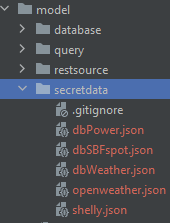

# Energy Saver

**VORAUSSETZUNGEN**
1. Datenbankserver MySQL
   1. Datenbankuser mit Berechtigung Datenbanken zu erstellen, Tabellen zu erstellen, CRUD Operationen auszuführen
2. Node.js >= Version 16

**INSTALLATION**
1. Erstellen der Datenbanken
   1. power
   2. wetter
   3. sbfspot
2. Einspielen der Scripts aus dem Verzeichnis ./system in die jeweilige Datenbank:
   1. Datenbank power -> CreateMySQL_Power_DB.sql
   2. Datenbank wetter -> CreateMySQL_Wetter_DB.sql
   3. Datenbank sbfspot -> CreateMySQL_SBFspot_DB.sql
3. Herunterladen des Energy Savers: https://github.com/heusser4git/energysaver.git
4. Konfigruationsinformationen für die Datenbankverbindungen unter ./model/secredata ablegen:
   1. JSON-Files erstellen:
      1. dbPower.json
      2. dbSBFspot.json
      3. dbWeather.json
      
   2. Jeweils die DB-Verbinungsinformation als JSON-Objekt in den Files ablegen in der Form:
   3. {
      "password": "xxx",
      "user": "xxx",
      "database": "xxx",
      "host": "xxx",
      "port": 3306
      }
5. Konfigruationsinformationen für die REST-APIs unter ./model/secredata ablegen:
   1. JSON-Files erstellen:
      1. openweather.json
      2. shelly.json
   2. Openweatherapi
      1. {
         "apikey": "bcd3c8bcec345c7a611141e3cc3b8257",
         "latitude": 46.9821456,
         "longitude": 9.5761204
         }
   3. Shelly (Powersensor)
      1. {
         "ip": "192.168.1.3",
         "port": "80",
         "protocol": "http"
         }
6. Server starten:
   1. Root-Verzeichnis der App:
      1. node ./index.mjs

**REST-API**
- http://<localhost>:<port>/                                    Gibt die index.html aus dem Verzeichnis view aus

_Photovoltaik_
http://<localhost>:<port>/pvData/                             Gibt alle PV-Eintraege aus
http://<localhost>:<port>/pvData/1652554800-1652558400        Gibt alle PV-Eintraege waehrend einer definierten Periode aus
http://<localhost>:<port>/pvData/current                      Holt den aktuellsten PV-Eintrag bis max. 5min zurueck oder gibt ein leeres Objekt aus

_Wetter_
http://<localhost>:<port>/wetter/daily/                       Gibt alle täglichen Wetterprognosen aus
http://<localhost>:<port>/wetter/daily/1652554800-1652558400  Gibt alle täglichen Wetterprognosen waehrend einer definierten Periode aus
http://<localhost>:<port>/wetter/daily/449                    Gibt gibt die tägliche Wetterprognose mit der angegebenen ID aus

_Strommessung Hauseingang_
http://<localhost>:<port>/power/                             Gibt alle Power-Eintraege aus
http://<localhost>:<port>/power/1652554800-1652558400        Gibt alle Power-Eintraege waehrend einer definierten Periode aus
http://<localhost>:<port>/power/current                      Holt den aktuellsten Power-Eintrag bis max. 5min zurueck oder gibt ein leeres Objekt aus

// TODO
~~- routen für weather~~
~~- daten von shelly abholen~~
~~- routen für shelly~~
~~- secretdata einbinden~~
~~- test mit express: website ausgeben~~

~~- close connections!!!~~
~~- demodatageneratoren: ~~sbfspot~~, ~~shelly~~~~
- create helper class
~~- openweathermap (key remove)~~
~~- Shelly (secretdata implementation)~~

- Devices implementieren (Waschmaschine, ...)
  - DB für devices
  - Object/Repo für devices
  - REST-route für devices
- installation
  ~~- create database script~~
  ~~- anleitung~~
  - tests

DOKU
fs -> What is Synchronous and Asynchronous approach? -> https://www.geeksforgeeks.org/node-js-file-system/